# EasyPark_App
## 🚗 MERN EasyPark Booking Management Application
### Quoc Lam & Yumi Yu

---

💎 Deployed App: http://www.ezcarparkspot.com/

🖥 GitHub Repo: https://github.com/Wokko-wok/EasyPark_App

📖 Part A Documentation Repo: https://github.com/Wokko-wok/EasyPark_App-Documents

## Installation Instructions

To use the app locally, please follow the below instructions.

- Create a directory in a suitable location on your machine named and `$ cd` into it.
- Whilst in the directory, from bash CLI, clone the server repo `$ git clone https://github.com/Wokko-wok/EasyPark_App.git`.
- CD into the api folder `$ cd api`.
- Install yarn packages with `$ yarn`.
- From bash run `$ yarn start` to start the local server.
- The server will run on local host port 27017.
- In another terminal CD into the client folder `$ cd client`.
- Install yarn packages with `$ yarn`.
- From bash run `$ yarn start` to start the local client.
- The server will run on local host port 3000.

On the deployed application 2 accounts have been prepared for viewing

To view as admin:

  email: Admin@test.com

  password: Admin1

To view as a normal user:

  email: test@test.com

  password: Password

(You can also create an account as you see fit)

---

## API Endpoints

| Users               | Bookings                | Carparks                  |
| ------------------- | ----------------------- | ------------------------- |
| POST /register      | GET /                   | GET /:id                  |
| POST /login         | GET /:id                | GET /                     |
| GET /               | GET /all                | POST /                    |
| DELETE /:id         | GET /user/:userId       | DELETE /:id               |
|                     | POST /                  | PUT /:id                  | 
|                     | PUT /:id                |                           |                    
|                     | GET /:id                |                           |                    
|                     | DELETE /:id             |                           | 

---

## Testing

The application has been tested in Chrome on Mac OS.

The production and development applications have both gone through extensive automated and manual testing with Postman, JEST, REST Client and Cypress.

- Manual test logs: https://docs.google.com/spreadsheets/d/1JKDUfCoHt_nbstkc0rgSBTqE7ZVkpLL6dFifslC6bE8/edit?usp=sharing

- Postman :
  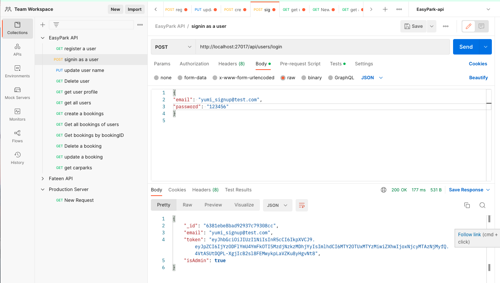

- REST : 
  

- Cypress : 
  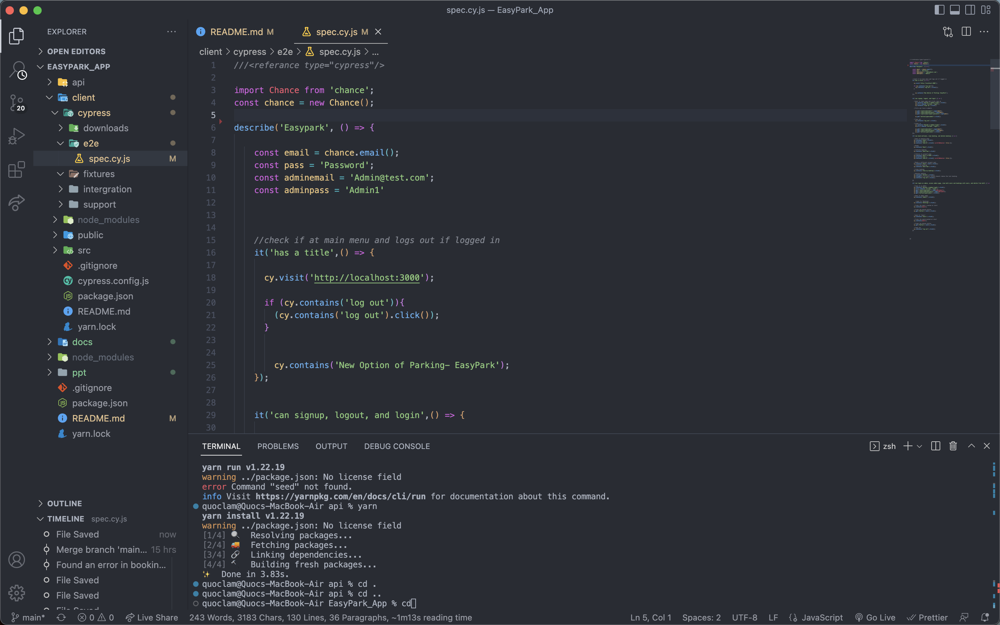

---

## Screenshots of Current Site

#### Home Page

#### Login

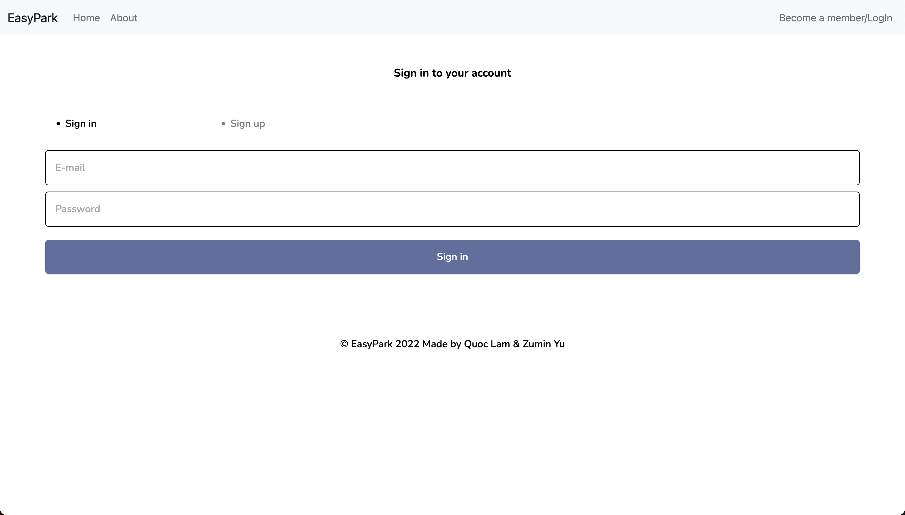

#### Search on Home PAge

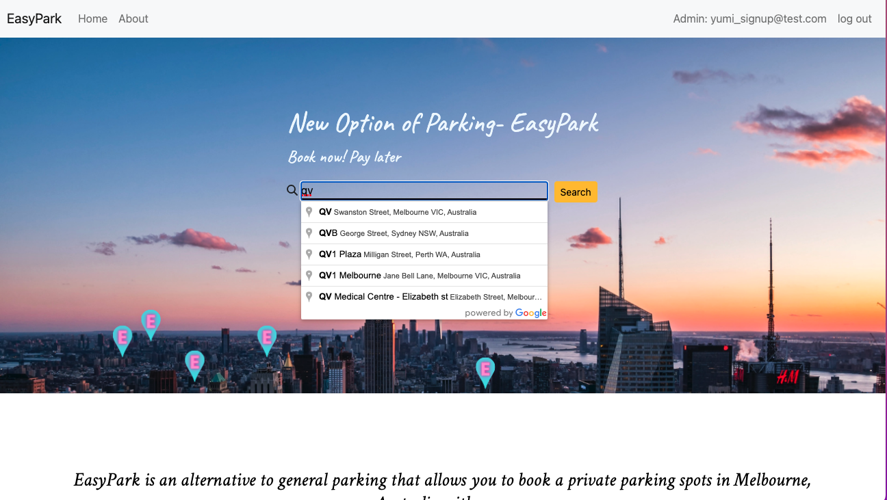

#### Carpark List Page 

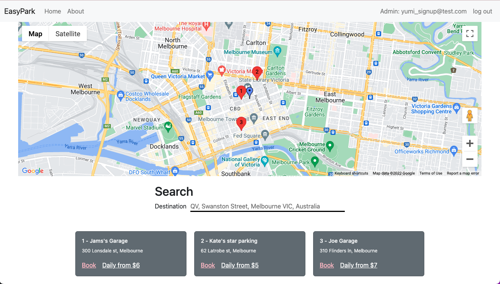

#### Booking

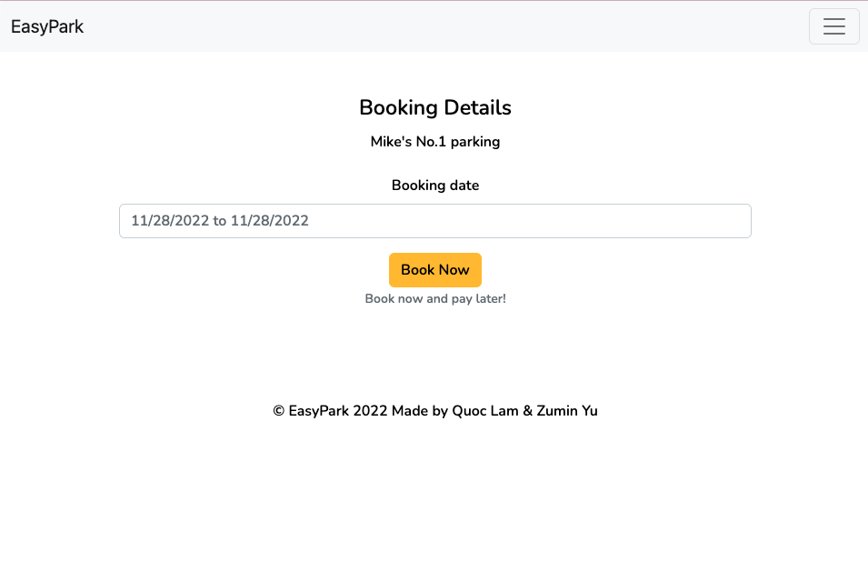

#### Success

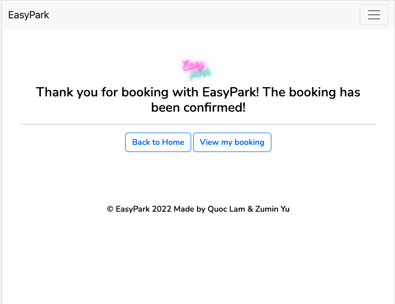

#### User Bookings

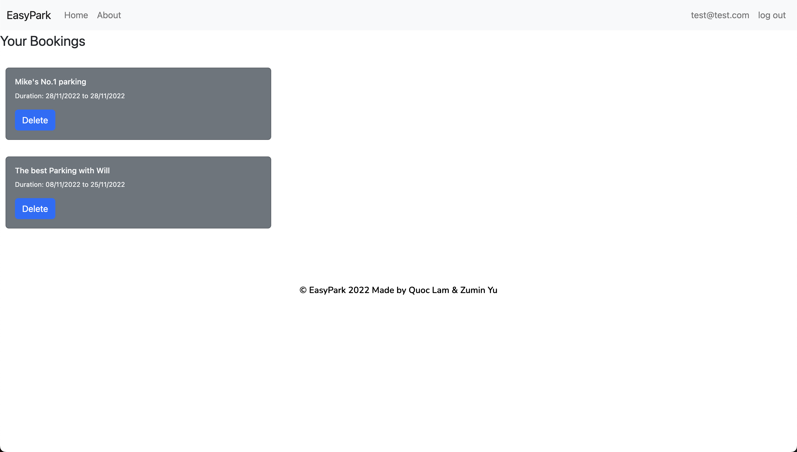

#### Admin Page

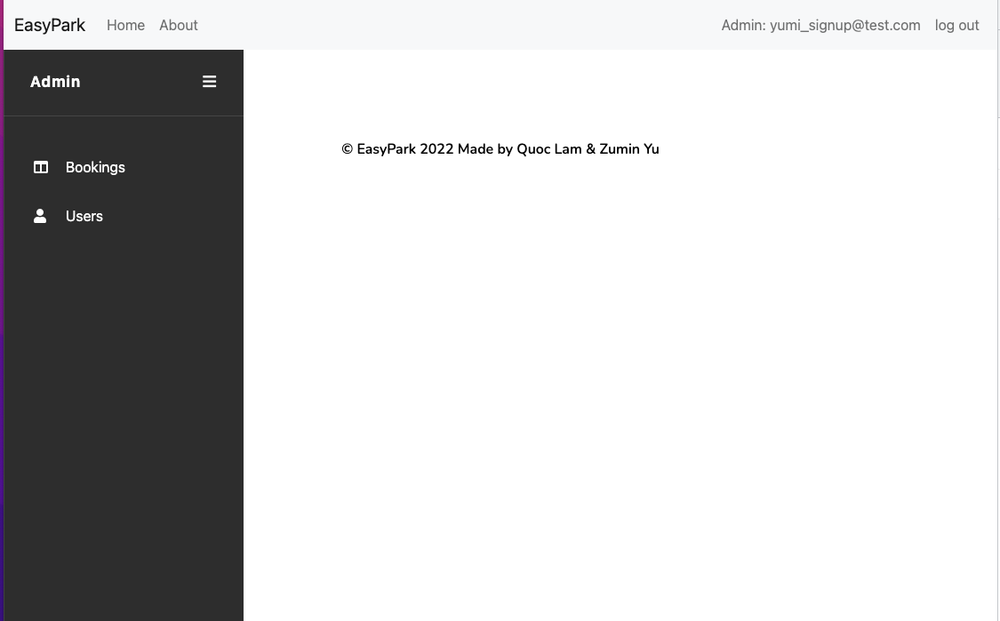

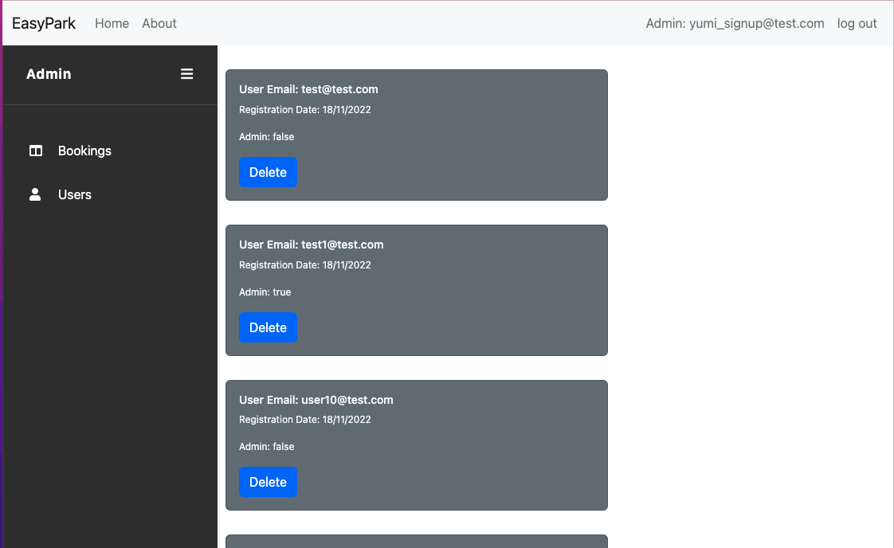

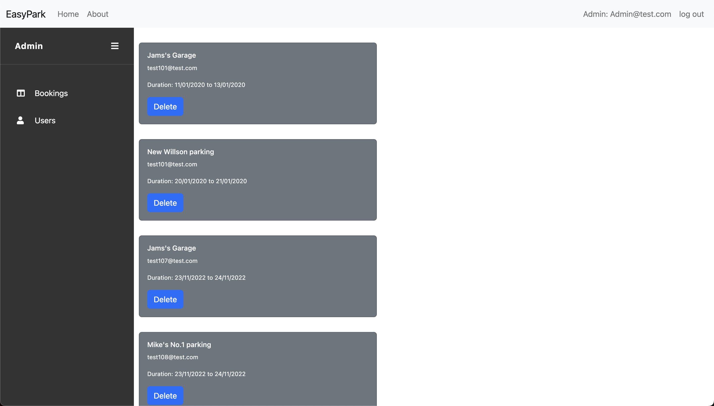

---

#### Purpose

This web app will serve two main purposes. The first is to allow vehicle owners to book a safe parking spot near a desired location for a certain period of time in the Melbourne, Australia. The other is to allow the manager of the company to manage these parking spots and bookings. 

As it stands a driver looking for a parking spot in locations such as in the city, a shopping center or at an airport are forced to do the same sequence over and over again. To find a spot they would have to either look up these locations beforehand or aimlessly drive around, both resulting in the driver hoping to find a vacant parking spot. Even if they end up finding a space there is usually no guarantee that the vehicle will be left unscathed. Research done by the National Road Safety Partnership Program reports that collisions that include a parked vehicle make up 51% of reported car park collisions. In fact collisions with a parked vehicle are 6 times more likely to happen in car parks than in any other driving environment. Insurance data reveals that the net incurred cost of car park incidents is approximately $3,000 this does not include the loss of time completing insurance claims as well as the potential profit loss due to a vehicle being out of commission during repairs. (Reference https://www.nrspp.org.au/product/car-parks-campaign/)

Easypark provides an alternative to general parking by providing an affordable, secure, and more flexible car park option. The app contains a wide selection of available privately owned parking and garages that the user can choose from. It allows the user to book a parking spot near a desired location and choose the duration of stay which can range from a day to a few months. They can also view their previous bookings and leave a rating for other users to see. To ensure that the user's vehicle is secure, all private car parks that are posted are reviewed and must pass strict guidelines to ensure accuracy and safety.

------

####  Target audience

This website is aimed towards vehicle owners or tourists in Melbourne who are looking to book an affordable, convenient and reliable parking spot around/near a desired location.

---

#### User Stories

- As a general user, I want to sign up and log in so that the website will remember my details for future bookings.
- As a user, I want to be able to search my destination so that I can see what parking is available.
- As a person looking for a spot, I want to be able to book a location so that I know that it is only available to me.
- As a person that cares for my car, I want a secure parking spot so that my car is safe.
- As a person looking for a parking spot, I want to be able to see parking spots on a map so that I can visually see the distance from the spot to the destination and choose the closest one. 
- As a person that is traveling, I want a parking spot that is more flexible than public parking so that I can park closer to my destination.
- As a busy person, I want a parking spot that is easier to access so that I can get to my vehicle more quickly.
- As a returning user, I want to be able to see previous bookings, so that I can book the same spot again at a later date. 
- As a concerned user, I want to be able to rate a parking spot so that other users can see if it is a good/bad location.
- As a power user I want to be able to choose how long I can reserve a parking spot, so that can keep my vehicle at a location for extended periods of time. 
- For example a whole month.As the manager, I want to be able to see information such as location, price, time and availability so I know what I can offer to my customers.
- As a manager, I want to be able to manage all bookings so that I can add, edit and remove bookings with ease.

------

####  Functionality / Features

Not all features of the site will be available to all users of the web app. This is due to the different types of users expected to use the application. Without logging in all users are able to:

- Search a location
- View available parking spots around that location (with a map)

But to progress further, they are required to log in either with an existing account or create a new one. Once logged in a normal user should be able to:

- Book a parking spot for a specified period of time
- View their previous bookings

Verified users (managers) have access to further features such as:

- Editing and removing existing Bookings & Users

------

#### Dataflow Diagram

*The Diagram above displays the expected flow of data within the application.*

------

#### Application Architecture Diagram

*This diagram show the interaction between the user, the Frontend, and Backend as well as the processes within them.*

---

#### Wireframes

*This is the planned layout of all the pages of the  application. Including different views such as mobile.*

---

#### Spring Planning

We have selected Trello as our planning methodology as it is easier to visualize tasks and allows us to manage the project by separating the tasks into cards and prioritizing major ones. Another tool used is Discord which is a voice, video, and text communication app. This is essential as it is essential to keep contact with each other.

### Part A Sprint

*This is the initial look fo the trello board.*

*As progress was done the trello board is updated including the addition of new objectives.*

*This is the latest look of the trello board before submission*

---
#### Future Development:

As it stands some features were not included due to time constraints and in future we would love to add them. These features are:
- Re-booking previous locations
- Leaving & Viewing Ratings
- Google Login
- View a summary of all daily bookings

---

#### Tech Stack:

**Front-end**: HTML5, CSS3, REACT.JS, Javascript, JSX, AXIOS, Bootstrap and Style-Component

**Back-end**: Node, ExpressJS

**Database**: MongoDB, Mongoose

**Deployment**: Back-end: AWS Front-end: AWS

**Testing**: Manual, Jest, Cypress, & REST

**Project-management tools**: Trello, Discord

**Utilities**: Draw.io, Figma, Lucid-chart

**DevOps**: Git, Github, VS Code

---

#### Retrospective

Looking back doing this project was a great learning experience for both of us. Neither of us have worked on an application with another user before but instead worked on applications on our own. Jumping into not only our first time making a MERN application but one as a team which was a big challenge for us as we both not only had our own commitments but lived in different time zones as well. Syncing up our work flow was initially a difficult challenge but we pulled through. We would help each other when we encountered issues that we couldn't overcome ourselves and worked on problems as a team. The only thing that we aren't happy with was the fact that we didn't have more time to work on the project and add more features. 