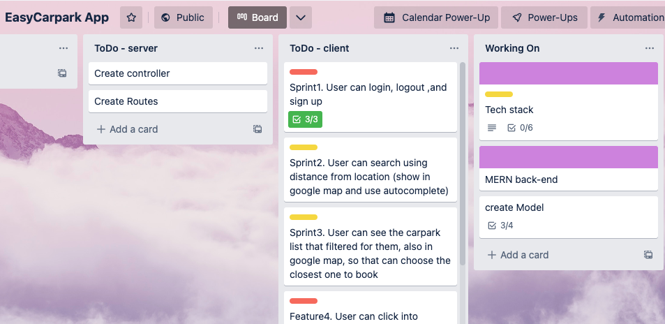
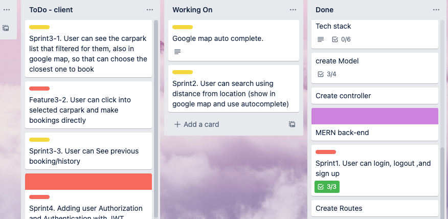
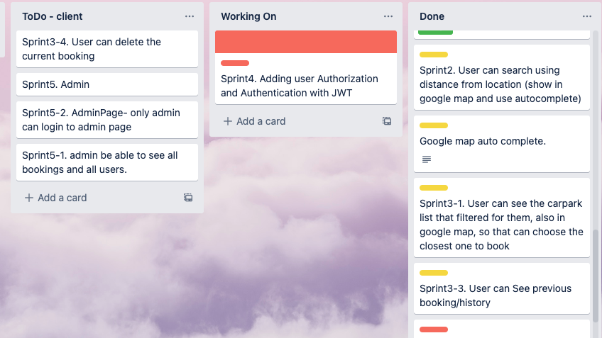

# EasyPark_App
## 🚗 MERN EasyPark Booking Management Application
### Quoc Lam & Yumi Yu

---

💎 Deployed App: http://www.ezcarparkspot.com/

🖥 GitHub Repo: https://github.com/Wokko-wok/EasyPark_App

📖 Part A Documentation Repo: https://github.com/Wokko-wok/EasyPark_App-Documents

## Installation Instructions

To use the app locally, please follow the below instructions.

- Create a directory in a suitable location on your machine named and `$ cd` into it.
- Whilst in the directory, from bash CLI, clone the server repo `$ git clone https://github.com/Wokko-wok/EasyPark_App.git`.
- CD into the api folder `$ cd api`.
- Install yarn packages with `$ yarn`.
- From bash run `$ yarn start` to start the local server.
- The server will run on local host port 27017.
- In another terminal CD into the client folder `$ cd client`.
- Install yarn packages with `$ yarn`.
- From bash run `$ yarn start` to start the local client.
- The server will run on local host port 3000.

On the deployed application 2 accounts have been prepaired for viewing

To view as admin:

  email: Admin@test.com

  password: Admin1

To view as a normal user:

  email: test@test.com

  password: Password

(You can also create an account as you see fit)

---

## API Endpoints

| Users               | Bookings                | Carparks                  |
| ------------------- | ----------------------- | ------------------------- |
| POST /register      | GET /                   | GET /:id                  |
| POST /login         | GET /:id                | GET /                     |
| GET /               | GET /all                | POST /                    |
| DELETE /:id         | GET /user/:userId       | DELETE /:id               |
|                     | POST /                  | PUT /:id                  | 
|                     | PUT /:id                |                           |                    
|                     | GET /:id                |                           |                    
|                     | DELETE /:id             |                           | 

---

## Testing

The application has been tested in Chrome on Mac OS.

The production and development applications have both gone through extensive automated and manual testing with Postman, JEST, REST Client and Cypress.

- Manual test logs: https://docs.google.com/spreadsheets/d/1JKDUfCoHt_nbstkc0rgSBTqE7ZVkpLL6dFifslC6bE8/edit?usp=sharing

- Postman :
  

- REST : 
  

- Cypress : 
  

---

## Screenshots of Current Site

#### Home Page

#### Login

#### Search on Home PAge

#### Carpark List Page 

#### Booking

#### Success

#### User Bookings

#### Admin Page

---

## Project management

----

We have selected Trello as our planning methodology as it is easier to visualize tasks and allows us to manage the project by separating the tasks into cards and prioritizing major ones. Another tool used is Discord which is a voice, video, and text communication app. This is essential as it is essential to keep contact with each other.

In phase one we planned our wireframe, user stories, data flow and the app architecture frame according to the client requests. When we went to the second phase, we checked all the user stories and turned them into many sprint tasks. We discussed together and picked the tasks that we wanted to complete, each sprint was added as a card in trello. In the trello card we also put more details such as description, checklist and priorities, so that we can make sure we stick with our plan most of the time. However, it was a bit hard to estimate the sprint complete time when we started, but getting a lot better after a few tasks. As we adopt agile methodology, we also organize a sprint review at the end of a sprint, so we share what we’ve learned and really help with the future coding experience. 

We were doing 3 day sprints each day at 10am with a stand-up on Discord. Towards the end as we needed more communication, we increased our sprints to twice daily, so we are all in sync with our project. When any of us are stuck on the coding, we are pair-programming and debugging together, and we both enjoy doing that. 

- Sprint 1

We started with back-end first, as we chose the challenging MERN stack, in the first few days we spent more time on research and study then writing code. We followed the model, controller and route structure to start our back-end. We perform the testing constantly by using postman and REST Client when we coding and it is actually very fun to start testing this way. 

- Sprint 2-3

After completing our back-end, we start our frontend coding. We first designed the pages and planned navigate routes for the app. Then we start from the Home page. As our app heavily relies on Google API, we decided to start with Google places autocomplete function. We have so many issues with Google-api-key, we accidentally pushed the key to GitHub so many times, that we always have to apply for the new key in the end. But it was so much fun to use this api and we both learned a lot by implementing this api to our project. 

- Sprint 4

At this stage, it was all very smooth until we added a token. We were pair programming for days trying to fix our Sign in and sign up issue. Through this sprint, we learned the difference between localStorage and sessionStorage, and realized how important the token head is and how to use it on GET or POST functions.

-  Sprints 5

Towards the final stage, most of the pages are done and we adopt a new sidebar for our admin page. Looks more professional. Also we start to pay attention to more details, for example the styling and clean the code. The last few days we are both working really hard on testing, it was really interesting to use Cypress and jest, including the manual unit testing spreadsheet. 

